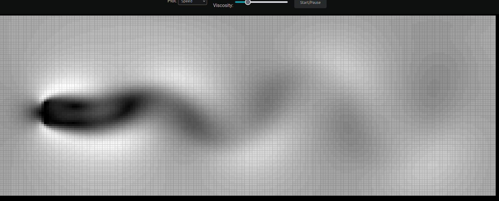

# Interactive Fluid Simulation
Try the demo here: [https://sam-martis.github.io/LBM_Scribbler/](https://sam-martis.github.io/LBM_Scribbler/)

Our project is an interactive fluid simulation that allows users to visualize and control fluid dynamics in real time through a web-based interface. The simulation is built using HTML, CSS, and JavaScript, with Web Workers for efficient computations and interactive controls for adjusting fluid properties.

## Key Features
- *Real-time Fluid Simulation* – Uses a Canvas-based rendering to simulate fluid flow dynamically.
- *Interactive Controls* – Users can adjust viscosity and drag via sliders to observe their effects.
- *Reset & Pause Functions* – Ability to reset the simulation or pause/resume the animation.
- *Web Workers for Performance* – Heavy computations are offloaded to Web Workers, ensuring smooth performance.
- *Gradient-based Visualization* – Changes in viscosity and drag affect the color gradient, visually representing fluid behavior.

## Technology Stack
- *Frontend:* HTML5, CSS3, JavaScript
- *Canvas API:* Used for rendering fluid effects
- *Web Workers:* Parallel processing for smooth fluid dynamics
- *GitHub Integration:* Hosting and version control

## Project Goal
The goal of this project is to provide an intuitive and educational tool for users to understand the principles of fluid mechanics interactively. By adjusting parameters, users can explore how viscosity and drag influence fluid behavior.

## Future Enhancements
We can extend this project by adding more physical properties (temperature, turbulence) and integrating 3D visualization.
