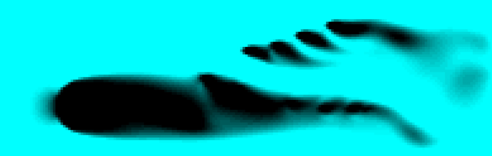
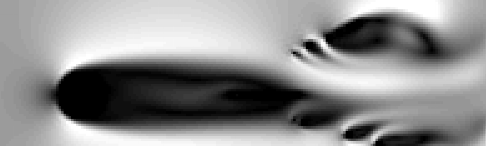
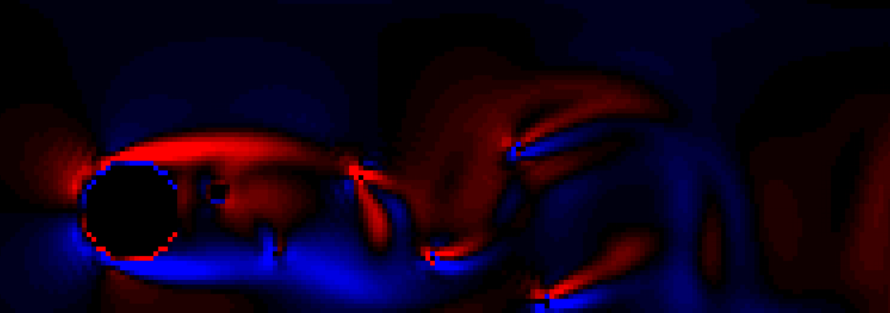

# Interactive Fluid Simulation

Try the demo here: [https://sam-martis.github.io/LBM_Scribbler/](https://sam-martis.github.io/LBM_Scribbler/)

Our project is an interactive fluid simulation that allows users to visualize and control fluid dynamics in real time through a web-based interface. The simulation is built using HTML, CSS, and JavaScript, with Web Workers for efficient computations and interactive controls for adjusting fluid properties.

## Key Features

- *Real-time Fluid Simulation* – Uses a Canvas-based rendering to simulate fluid flow dynamically.
- *Interactive Controls* – Users can adjust viscosity and drag via sliders to observe their effects.
- *Reset & Pause Functions* – Ability to reset the simulation or pause/resume the animation.
- *Web Workers for Performance* – Heavy computations are offloaded to Web Workers, ensuring smooth performance.
- *Gradient-based Visualization* – Changes in viscosity and drag affect the color gradient, visually representing fluid behavior.

## Technology Stack

- *Frontend:* HTML5, CSS3, JavaScript
- *Canvas API:* Used for rendering fluid effects
- *Web Workers:* Parallel processing for smooth fluid dynamics
- *GitHub Integration:* Hosting and version control

# Introduction to the Lattice Boltzmann Method (LBM)

Imagine trying to understand how water flows around rocks in a river or how air moves over an airplane wing. These are complex problems, but they’re exactly the kind of challenges that the Lattice Boltzmann Method (LBM) helps us to tackle. LBM is a way to simulate fluid flow using computers. Unlike traditional methods that rely on solving complicated equations like the Navier-Stokes equations directly, LBM takes a more intuitive approach. It models fluids as if they were made up of tiny particles moving around on a grid. This makes it easier to simulate tricky situations like turbulence, flows with multiple phases (like oil and water mixing), or even how fluids behave when they encounter obstacles.

 LBM is based on the idea of particles. Instead of treating the fluid as one big, continuous mass, LBM breaks it down into smaller parts. Each part is represented by something called a distribution function, which tells us the likelihood of particles moving in certain directions. The simulation happens on a grid, where each cell contains these distribution functions. The process alternates between two main steps: streaming and collision. During the streaming step, particles move to neighboring cells based on their direction. In the collision step, particles interact with each other and redistribute themselves to reach a state of balance. This back-and-forth between movement and interaction is what makes LBM so effective at capturing the dynamic nature of fluids.

## Project Goals

The goal of this project is to create a 2D simulation of fluid flow using LBM, like building a virtual lab where we can study how fluids behave in different scenarios. We’ll focus on modeling fluid flow on a flat, two-dimensional grid. To make things more interesting, we’ll also include obstacles within the fluid domain. These obstacles could represent anything from rocks in a river to walls in a pipe. By studying how the fluid interacts with these barriers, we can gain valuable insights into real-world fluid dynamics.

Along with simulating the flow, we'll compute the fluid's density and velocity, among other crucial characteristics. While velocity indicates the fluid's speed and direction of motion, density indicates the amount of "stuff" in a given region. We'll employ visualization strategies to help make the results more comprehensible. For instance, we'll make density charts, which employ colors to emphasize regions of high or low fluid concentration, and velocity fields, where arrows indicate the fluid's speed and direction. Additionally, vortices—twirling motions that frequently occur in flowing liquids or gases—will be examined.

## Technical Details of the Implementation

### Grid Setup

We'll split the area into a 2D grid in order to set up the simulation. The grid's cells will function as tiny containers that store data about the particles they contain. In particular, there will be nine distribution functions in every cell. Four of these indicate particles traveling in the cardinal directions (north, east, south, and west), four represent particles traveling diagonally (northeast, southeast, southwest, and northwest), and one represents particles that are stationary (rest particles). This configuration guarantees that we record every motion direction, providing us with a comprehensive image of the fluid's behavior.

### Macroscopic Properties

We can determine the fluid's density and velocity using these distribution functions. Density, which simply indicates how "thick" or "thin" the fluid is in a given space, is the total number of particles in a cell. Conversely, velocity indicates the fluid's speed and direction of motion. For instance, the y-velocity considers north against south, but the x-velocity considers the number of particles traveling east versus west. We can better comprehend the fluid's behavior on a bigger scale thanks to these computations.

### Streaming Step

Particles follow their designated routes to travel to nearby cells during the streaming process. However, what occurs if they encounter a barrier? Boundary conditions are useful in this situation. A process called bounce-back occurs when a particle hits a barrier and returns in the opposite direction. We employ periodic boundary conditions at the grid's edges, which means particles that exit one side of the grid resurface on the other. These guidelines guarantee that the simulation remains physically precise and lifelike.

### Collision Step

The collision step is when the particles engage with one another after they have moved. The magic happens right here! We compute new distribution functions that bring the system closer to equilibrium using a method that takes into account variables such as the weight of each direction, the particle velocity, and the fluid's total density. The rate at which the system achieves this balanced state is determined by a relaxation parameter, which also influences the viscosity of the fluid. We maintain the simulation's adherence to the laws of physics by updating the distribution functions following every collision.

### Visualization

Since visualization aids in our understanding of the data, it is an essential component of the project. It would be overwhelming to try to comprehend fluid flow solely by looking at figures! Rather, we'll employ tools like density plots, which emphasize regions of high or low fluid concentration using color gradients, and velocity fields, where arrows indicate the fluid's speed and direction. Additionally, we will visualize vortices, which are whirling patterns frequently found in fluids in motion. In addition to simplifying the interpretation of the results, these visualizations help us identify intriguing events that could otherwise go overlooked.

## Implementation Details

### Data Structures

To manage the simulation, we’ll use several data structures. Arrays will store the distribution functions for each cell, representing the movement of particles in different directions. A separate boolean array will mark the locations of obstacles within the grid. Additionally, we’ll maintain arrays for macroscopic properties like density and velocity, ensuring that we can quickly access and update these values as the simulation progresses.

### Streaming Function

The streaming function is responsible for moving particles to neighboring cells. It also handles boundary conditions, applying bounce-back rules for obstacles and periodic conditions at the edges of the grid. This ensures that the simulation adheres to the physical constraints of the problem, keeping everything realistic and consistent.

### Collision Function

The collision function calculates the macroscopic density and velocity for each cell. It then updates the distribution functions using equilibrium distributions and the relaxation parameter. This step is critical for maintaining the accuracy and stability of the simulation, ensuring that the fluid behaves as expected.

### Main Simulation Loop

The main simulation loop ties everything together. It starts by initializing the distribution functions and setting up the barriers. Then, it alternates between the streaming and collision steps, updating the state of the fluid at each iteration. After each cycle, the results are visualized to provide insights into the fluid’s behavior. This process repeats for a specified number of time steps, allowing the simulation to evolve over time.

## Challenges and Solutions

### Boundary Conditions

One of the biggest challenges in implementing LBM is handling boundary conditions effectively. Ensuring that particles interact correctly with obstacles and stay within the grid requires careful planning. To address this, we use bounce-back conditions for barriers and periodic conditions at the edges of the grid. These strategies keep the simulation physically realistic and prevent particles from behaving in ways that don’t make sense.

### Performance

Simulating large grids or running long simulations can be computationally expensive. To improve performance, we optimize the code by reducing redundant calculations and using efficient data structures. These optimizations help the simulation run faster without sacrificing accuracy.

### Visualization

The representation of fluid behavior in an understandable manner presents another difficulty. We use a variety of visualization strategies, including vorticity plots, arrows, and color maps, to get around this. By highlighting important fluid characteristics, these tools facilitate the interpretation of the data and the development of insightful conclusions.

The objective of this research is to develop a reliable and perceptive 2D fluid simulation by tackling these issues and utilizing the advantages of the Lattice Boltzmann Method. This simulation offers an effective tool for learning about the intriguing field of fluid dynamics, whether your goal is to comprehend how fluids move around barriers or to appreciate the beauty of vortices.
